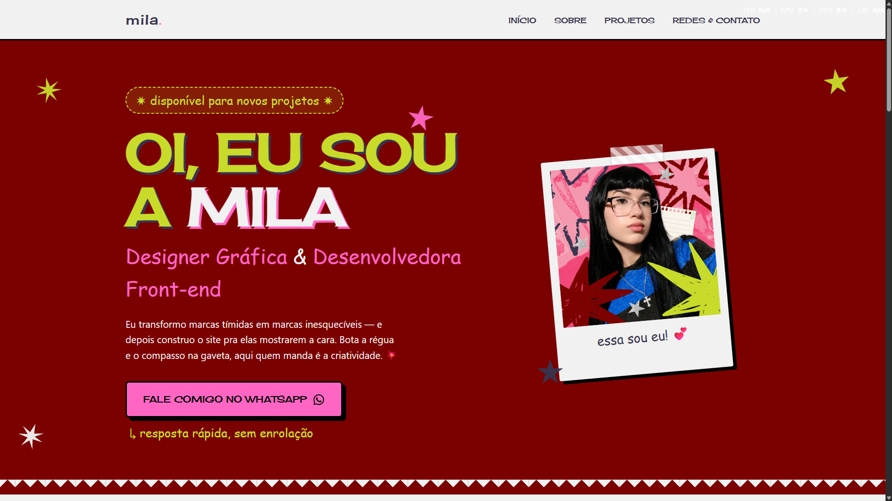

# 🌐 Portfólio Pessoal | Mila

  

  

---

## ★ Sobre o Projeto

Este é o meu portfólio pessoal, projetado e desenvolvido para apresentar meus principais projetos, habilidades técnicas e formas de contato. A página foi construída com foco em **design moderno**, **navegação intuitiva** e **responsividade total** para diferentes dispositivos.

---

## ★ Tecnologias Utilizadas

O projeto foi desenvolvido utilizando as seguintes tecnologias:

- **HTML5:** Estrutura semântica e acessível.
- **CSS3:** Estilização com **Flexbox** e **CSS Grid** para layouts responsivos.
- **Font Awesome / SVGs:** Ícones interativos para redes sociais e projetos.
- **Git & GitHub:** Controle de versão e hospedagem do código.
- **Netlify:** Deploy automático e hospedagem contínua.

---

## ★ Funcionalidades e Seções

- **Hero Section:** Apresentação inicial com chamada para ação rápida.
- **Sobre Mim:** Resumo profissional e principais competências.
- **Galeria de Projetos:** Cards responsivos com links diretos para demonstrações ao vivo e repositórios.
- **Central de Contato:** Redirecionamento rápido para redes profissionais e canais diretos.

---

## 🔗 Meus Links & Redes Sociais

Sinta-se à vontade para me mandar uma mensagem ou acompanhar meu trabalho:

- 💼 **LinkedIn:** [linkedin.com/in/milagraphicss](https://linkedin.com/in/milagraphicss)
- 🎨 **Behance:** [behance.net/milagraphicss](https://behance.net/milagraphicss)
- 📷 **Instagram:** [instagram.com/milagraphicss](https://instagram.com/milagraphicss)
- 💬 **WhatsApp:** [Fale comigo no WhatsApp](https://wa.me/5551995176019)
- ✉️ **E-mail:** [designstudiorisco@gmail.com](mailto:designstudiorisco@gmail.com)

---

  Desenvolvido por <strong>Mila</strong> ✨

